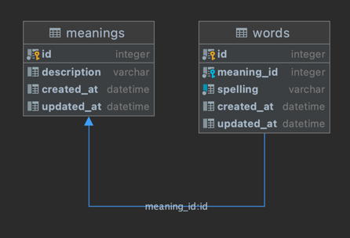

# Thesaurus
## Description
- Framework used: Lumen 8. It is designed for services, lightweight and i wanted to learn it in the process
- DB seeded with 182 (faker unique words limit) unique words randomly assigned to 50 synonym groups
- DB schema: 
  
- This implementation assumes each word can have only one meaning. To properly support multiple meanings i would have to change interface stated in requirements and add additional DB table. Logic implemented:
  - If some words already exists, we use same meaning for other words
  - If no word already exists, we create new common meaning for all of them
  - If some words already exists, but with different meanings, we return an error, as words with different meanings are not allowed in our DB
- Pagination and security layer were not implemented as i have run out of time :)
- Hours spent: 4.5 (design, develop, package)
- To simplify testing, [Thesaurus.postman_collection.json](Thesaurus.postman_collection.json) can be imported into Postman

## Endpoints
- GET / ---allWords
- GET /{word}   ---getSynonyms
- POST /    ---addSynonyms (array 'words' expected in request body)

## Installation
- composer install
- php artisan migrate --seed
- php -S localhost:8000 -t public/
